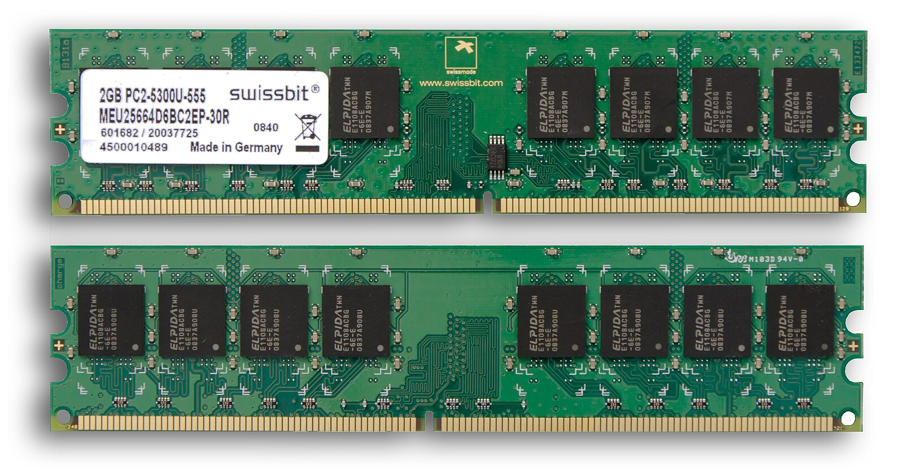
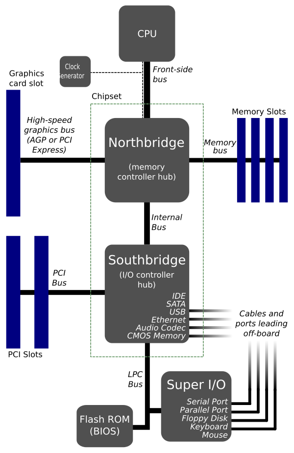

## DDR5

DDR5 SDRAM(double data rate fifth-generation synchronus dynamic randon-access memory)，DDR5有包含ECC(Error-Correcting Code memory)

屬於SDRAM，

## SDRAM

## SRAM

SDRAM(static random-access memory)
(靜態)隨機存取記憶體，只要保持通電，儲存的資料就不會消失。

## DRAM

DRAM(dynamic random-access memory)
(動態)隨機存取記憶體，
一個位元需要一個電容&一個電晶體來處理，相較於SRAM通常需要6個電晶體，因此DRAM可以擁有非常高的密度，單位體積容量高，成本較低。
但DRAM存取速度較慢，耗電量大，為了進一步提高速度，人們開發了同步（synchronous）DRAM或SDRAM，操作與外部時鐘同步，以實現高速執行。如今，DRAM一般都指SDRAM。

## DIMM

雙列直插式記憶體模組DIMM(Dual In-line Memory Module)64-bilt

DDR1234皆是很常見的DIMM
而SIMM是32-bit

# 早期電腦

早期電腦使用
- SIMM
    單列直插式主記憶體模組，用於擴充主記憶體
- FSB & BSB
    FSB已被Intel QPI和AMD HyperTransport等現代匯流排取代
    
    在在90年代中期，後端匯流排曾是保持數據移動的重要路徑。將CPU連接到第二級（L2）緩存資源並以CPU時鐘速度在CPU與L2緩存之間交換數據。

- 系統匯流排
    是一個單獨的電腦匯流排，是連接電腦系統的主要元件。這個技術的開發是用來降低成本和促進模組化。隨著CPU發展，配合CPU的運算速度越來越快，而發展出雙獨立匯流排(Dual Independent Bus，DIB)，分成FSB(處理CPU到北橋晶片) & BSB(處理CPU到L2)來處理不同運算速度的資料傳輸。而後又發展出如HyperTransport和Intel QuickPath Interconnect，當系統匯流排架構繼續使用於簡單的嵌入式微處理器時。系統匯流排也可以單獨成為一個積體電路而產生系統單晶片，例子有高級微控制器匯流排架構（AMBA），CoreConnect和Wishbone。[13]
    

## SIMM

單列直插式主記憶體模組（single in-line memory module，縮寫SIMM）是一種在20世紀80年代初到90年代後期在電腦中使用的包含隨機存取記憶體的主記憶體模組。它與現今最常見的雙列直插式主記憶體模組（DIMM）不同之處在於，SIMM模組兩側的觸點是冗餘的。SIMM根據JEDEC JESD-21C標準進行了標準化。

大多數早期PC主機板（基於8088的PC、XT、和早期AT）採用面向DRAM的插座式雙列直插封裝（DIP）晶片。隨著電腦主記憶體容量的增長，主記憶體模組被用於節約主機板空間和簡化主記憶體擴充。相比插入八、九個DIP晶片，只需插入一個主記憶體模組就能增加電腦的主記憶體。

## BUS

主要匯流排的作用是在中央處理器、主記憶體、輸入輸出裝置間溝通資料，被稱為前端匯流排，而後端匯流排則是用來存取第二階快取。

## FSB

## BSB

後端匯流排BSB(Back Side Bus)，用於帶有L2和L3緩存（Cache）的計算機中，處理緩存數據的後端匯流排實際上是以CPU時鐘速度運行。

## System Bus

系統匯流排，是一個單獨的電腦匯流排

## RDIMM & UDIMM

什麼是RDIMM？什麼又是UDIMM呢？
Intel 5500系列至強CPU2009年3月份推出，大家在為該系列CPU選購主機板時應該可以看到記憶體支援選項一般都是2種，一種是支持48G、一種是24G，同一個伺服器主機板怎麼會是兩種不同容量的記憶體支援呢？秘密就在記憶體類型一個是RDIMM，一個是UDIMM。

那什麼是RDIMM？什麼又是UDIMM呢？
RDIMM即Registered DIMM，表示控制器輸出的位址和控制信號經過Reg寄存後輸出到DRAM晶片，控制器輸出的時鐘信號經過PLL後到達各DRAM晶片。
UDIMM即Unbuffered DIMM，表示控制器輸出的位址和控制信號直接到達DIMM上的DRAM晶片。

RDIMM：
registered DIMM（Registered Dual In-line Memory Module），帶寄存器的雙線記憶體模組。Registered記憶體本身有兩種工作模式，即 Registered模式和Buffered模式。在支援Registered工作模式的主機板上工作時，Registered記憶體工作於 Registered模式，這時主機板上的位址信號和控制信號會比資料信號先一個時鐘週期到達DIMM，送入Register晶片後會在其中停留一個時鐘週期，然後在下一個時鐘信號的上升沿從Register輸出，與此時從主機板上到達DIMM的資料信號一起同時傳送到SDRAM。當Registered記憶體工作在普通的主機板上時，為Buffered工作模式，這時所有的信號也基本上是同時到達DIMM再同時傳送到SDRAM，Register晶片這時在功能上只相當於一個簡單的Buffer，其輸入到輸出之間是直通的，只簡單的起到改善位址信號和控制信號的作用，時序上與Unbuffered記憶體是一樣的。 （一般用於伺服器）
UDIMM:
無緩衝雙通道記憶體模組 (Unbuffered Dual In-Line Memory Modules，UDIMM).（一般常用的記憶體條，用於一般家商用）

## 緩衝區主記憶體(額外補充)
緩衝區主記憶體（Buffered Memory）是指暫存器主記憶體的一個早期術語。該緩衝區是放在主記憶體與主記憶體控制器之間。一般來說，暫存器主記憶體不能放在非暫存器主記憶體的插槽中使用，但同步動態隨機存取記憶體（SDRAM）則可以。

全緩衝DIMM （FB-DIMM）模組是用於一些主記憶體容量很大的系統。在普通的暫存器/緩衝區主記憶體中，只有控制線被緩衝，而在全緩衝主記憶體中，資料線也被緩衝，所有傳輸都以序列方式進行；每個FB-DIMM模組上的附加邏輯晶片將序列輸入轉換為驅動主記憶體晶片所需的並列訊號。[5]

低負載DIMM（Load Reduced DIMM，LRDIMM）模組與暫存器/緩衝區主記憶體類似，LRDIMM模組緩衝控制線和資料線，同時保持所有訊號的並列特性。因此，LRDIMM主記憶體能提供整體來說最大的主記憶體容量，同時解決序列與並列訊號轉換引起的FB-DIMM主記憶體的一些效能和功耗問題。[6]

FB-DIMM和LRDIMM型號的主記憶體主要是為控制指定時間內流入和流出主記憶體晶片的電流量而設計。這與暫存器/緩衝區主記憶體不相容，其主機板通常也不接受其他任何類型的主記憶體。