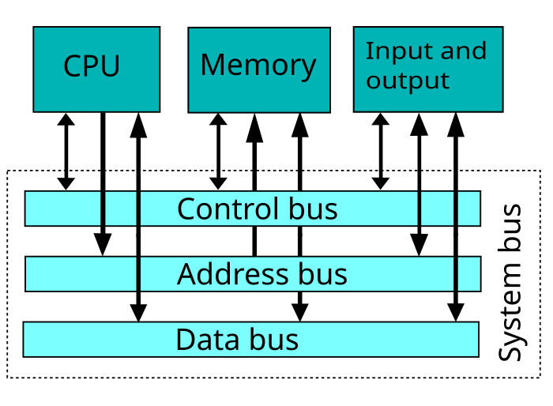

## DDR5

DDR5 SDRAM(double data rate fifth-generation synchronus dynamic randon-access memory)，DDR5有包含ECC(Error-Correcting Code memory)

屬於SDRAM，

## SDRAM

## SRAM

SDRAM(static random-access memory)
(靜態)隨機存取記憶體，只要保持通電，儲存的資料就不會消失。

## DRAM

DRAM(dynamic random-access memory)
(動態)隨機存取記憶體，
一個位元需要一個電容&一個電晶體來處理，相較於SRAM通常需要6個電晶體，因此DRAM可以擁有非常高的密度，單位體積容量高，成本較低。
但DRAM存取速度較慢，耗電量大，為了進一步提高速度，人們開發了同步（synchronous）DRAM或SDRAM，操作與外部時鐘同步，以實現高速執行。如今，DRAM一般都指SDRAM。

## DIMM

雙列直插式記憶體模組DIMM(Dual In-line Memory Module)64-bilt

DDR1234皆是很常見的DIMM
而SIMM是32-bit

# 早期電腦

早期電腦使用
- SIMM
    單列直插式主記憶體模組，用於擴充主記憶體
- FSB & BSB
    FSB已被Intel QPI和AMD HyperTransport等現代匯流排取代
    
    在在90年代中期，後端匯流排曾是保持數據移動的重要路徑。將CPU連接到第二級（L2）緩存資源並以CPU時鐘速度在CPU與L2緩存之間交換數據。

- 系統匯流排
    是一個單獨的電腦匯流排，是連接電腦系統的主要元件。這個技術的開發是用來降低成本和促進模組化。隨著CPU發展，配合CPU的運算速度越來越快，而發展出雙獨立匯流排(Dual Independent Bus，DIB)，分成FSB(處理CPU到北橋晶片) & BSB(處理CPU到L2)來處理不同運算速度的資料傳輸。而後又發展出如HyperTransport和Intel QuickPath Interconnect，當系統匯流排架構繼續使用於簡單的嵌入式微處理器時。系統匯流排也可以單獨成為一個積體電路而產生系統單晶片，例子有高級微控制器匯流排架構（AMBA），CoreConnect和Wishbone。[13]
    

## SIMM

單列直插式主記憶體模組（single in-line memory module，縮寫SIMM）是一種在20世紀80年代初到90年代後期在電腦中使用的包含隨機存取記憶體的主記憶體模組。它與現今最常見的雙列直插式主記憶體模組（DIMM）不同之處在於，SIMM模組兩側的觸點是冗餘的。SIMM根據JEDEC JESD-21C標準進行了標準化。

大多數早期PC主機板（基於8088的PC、XT、和早期AT）採用面向DRAM的插座式雙列直插封裝（DIP）晶片。隨著電腦主記憶體容量的增長，主記憶體模組被用於節約主機板空間和簡化主記憶體擴充。相比插入八、九個DIP晶片，只需插入一個主記憶體模組就能增加電腦的主記憶體。

## BUS

主要匯流排的作用是在中央處理器、主記憶體、輸入輸出裝置間溝通資料，被稱為前端匯流排，而後端匯流排則是用來存取第二階快取。

## FSB

## BSB

後端匯流排BSB(Back Side Bus)，用於帶有L2和L3緩存（Cache）的計算機中，處理緩存數據的後端匯流排實際上是以CPU時鐘速度運行。

## System Bus

系統匯流排，是一個單獨的電腦匯流排