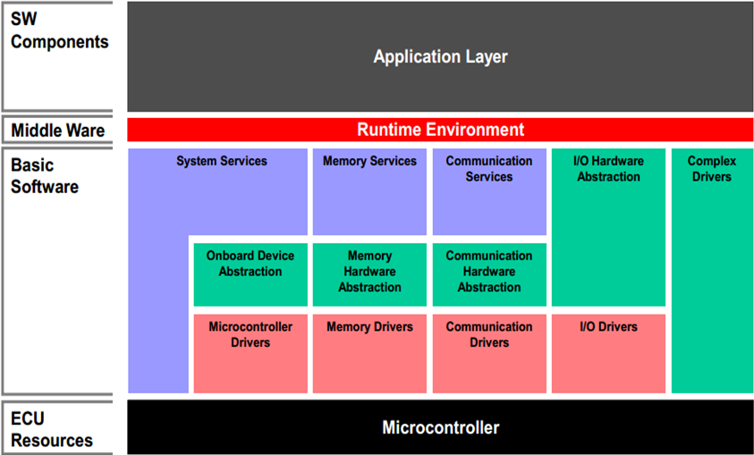
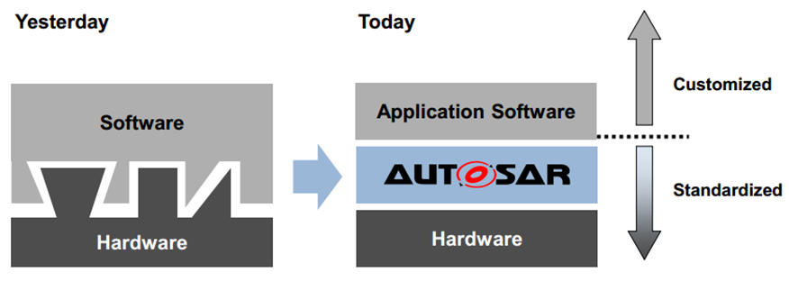

### 0604
```
Stellantis maybe our new project
BT = blue tooth
CMW500 寬頻無線通訊測試儀
HPC 高效能運算(High Performance Computing)
AUTOSAR (車輛開放系統架構；Automotive Open System Architecture) : interface between software & hardware to prevent any side effect when hardware or software change
```





### 0613

```
已知兩種方法可以存stderr
1. 用try except包起來，並且用logging & trace.format_exc()等方法，print & save
2. 用 sys.stderr = open('file', 'W') 來將sys.stderr替換成文件寫入

# 無法merge stderr & stdout輸出
# 在實際except發生時即跳出程式，後面的程式將不執行，所以一定要想辦法先將stderr重導向
```

### 0614

```
已修正
用try將上傳SF包起來，印出traceback & exception
以及移動close logger close handler的位置
須修正
1. SIG\utilities\runseqs.py
put_result_to_shopfloor return 造成沒有error code
2. 用同一個SN重複執行，會造成兩次main log擠在同一個檔案裡
```

### 0617

```
已修正
用try將上傳SF包起來，印出traceback & exception
以及移動close logger close handler的位置
須修正
1. SIG\utilities\runseqs.py
put_result_to_shopfloor return 造成沒有error code
2. 用同一個SN重複執行，會造成兩次main log擠在同一個檔案裡
```


### 0624

```
ATS
https://www.yuanshiuh.com.tw/serv5.htm

Serializer & Deserializer
https://www.hawyang-semi.com/product/serdes
Serializer : 並列轉序列
Deserializer : 序列轉並列

POE & POC
https://3smarket-info.blogspot.com/2016/02/poe-poc.html

rack(架子)
EMC(電磁兼容性或電磁兼容electromagnetic compatibility)
sumitomo(住友商事)客製化cable的廠商
```


### 0626

```
ARP
https://blog.downager.com/2013/07/03/%E7%B6%B2%E8%B7%AF-%E6%B7%BA%E8%AB%87-ARP-Address-Resolution-Protocol-%E9%81%8B%E4%BD%9C%E5%8E%9F%E7%90%86/
ARP 應是一個橫跨OSI L2 L3的協議，因其同時管理MAC address & IP address

OSI
https://vocus.cc/article/618c7853fd8978000108c4d5
https://medium.com/@acamvproducingstudio/osi%E4%B8%83%E5%B1%A4%E7%B6%B2%E7%B5%A1%E6%9E%B6%E6%A7%8B%E7%B0%A1%E4%BB%8B-%E8%A8%88%E7%AE%97%E6%A9%9F%E7%B6%B2%E8%B7%AF%E6%A6%82%E8%AB%96%E5%BF%83%E5%BE%97%E7%AD%86%E8%A8%98-%E4%B8%80-572b097bae4b


```


### 0627

```
Docker


promiscuous mode(混雜模式)一個網卡可以接收所有經過他的數據，無論目的地是否是它
https://zh.wikipedia.org/zh-tw/%E6%B7%B7%E6%9D%82%E6%A8%A1%E5%BC%8F
OSI
https://vocus.cc/article/618c7853fd8978000108c4d5
https://medium.com/@acamvproducingstudio/osi%E4%B8%83%E5%B1%A4%E7%B6%B2%E7%B5%A1%E6%9E%B6%E6%A7%8B%E7%B0%A1%E4%BB%8B-%E8%A8%88%E7%AE%97%E6%A9%9F%E7%B6%B2%E8%B7%AF%E6%A6%82%E8%AB%96%E5%BF%83%E5%BE%97%E7%AD%86%E8%A8%98-%E4%B8%80-572b097bae4b


```


### 0708
```
loop back 回送（英語：loopback）指將電子訊號、資料流等原樣送回傳送者的行為。 它主要用於對通訊功能的測試。
convert : 轉換，轉變
apt
dpkg(底層)
top
htop


```

### 0709
```
如何連線同IP的不同裝置?
1. 通過設定arp連線，綁定container & 網卡，而container連線於特定網卡，接著連線至某特定的機器，因此只需要控制container即可控制特定機器
2. 能不用docker嗎?通過設定arp連線，能使指定特定網卡連限於特定機器。但是PC卻不能透過控制指定網卡，來找到同IP的不同機器。能否解決不能控制指定網卡?
3. 有沒有其他方式?

comment : 
1. 在windows嘗試建立 mac vlan會跑出訊息
"docker network create -d macvlan -o parent=USB_dongle testtest
error during connect: Head "http://%2F%2F.%2Fpipe%2FdockerDesktopLinuxEngine/_ping": open //./pipe/dockerDesktopLinuxEngine: The system cannot find the file specified."
2. 在windows下使用Ubuntu VLAN 可以建立MACVLAN

Hyper-V是windows的虛擬化工具，若無法啟用的話，先檢查是否有安裝其他的虛擬化工具。(家用版無法啟用)
(可以用systeminfo檢查)
虛擬化工具會和Hyper-V衝突，建議移除重開再試一次
todo : 
在linux底下執行看看新UI
```

### 0809

```
[pyenv]
python 版本管理工具

在linux中尤其方便，完全不需要管linux原生的python,tkinter & pip
直接把環境改成指定的版本，包括指令(不過原本/usr/bin/中的軟連結不會被改變)
直接參考git hub 使用:
https://github.com/pyenv/pyenv?tab=readme-ov-file#installation
其他補充:
https://blog.kyomind.tw/ubuntu-pyenv/
若要修改docker裡面的環境請參考:
https://gist.github.com/jprjr/7667947?permalink_comment_id=3684823

[tcl]

todo :
1. 看起來lock沒有辦法解決segmentation fault(core dumped)
2. 確認那個SOP是不是要不能拆蓋的版本，所以會需要用GM tool，OTA回MTP的版本

```

### 0815

中英文每次停留180天
https://embamex.sre.gob.mx/finlandia/index.php/traveling/visas
https://oficinaenlace.sre.gob.mx/taiwan/index.php/consulares/visas

### 0820
pyenv install local
git clone https://github.com/pyenv/pyenv.git ~/.pyenv
https://github.com/pyenv/pyenv/issues/754

docker use save and load
https://www.zc0317.com/post/view?id=140

### 0902
LUN是啥
https://kb.synology.com/zh-tw/DSM/tutorial/How_to_set_up_an_iSCSI_LUN_with_thin_provisioning_on_my_Synology_NAS

provision是啥

SATA是啥

需要多了解儲存設備


## 甚麼是硬碟分割
```
硬碟分區（Disk Partition）
定義：

硬碟分區是將一個物理硬碟劃分成多個邏輯部分（區域）。每個分區在操作系統中看起來像是一個獨立的硬碟，可以單獨管理和使用。
```
## 硬碟分割和RAID的使用場合
```
好的，讓我們深入探討硬碟分區和 RAID 的使用場合，以及 RAID 的特性是如何實現的，並分析為何 RAID 的功能強於硬碟分區。

1. 硬碟分區的適用場合
使用場合：

簡單環境：對於單一用戶或小型系統，通常會將硬碟劃分為多個分區來分別存放操作系統、應用程式和數據。這樣可以使管理更簡單。例如：
家庭電腦：將硬碟分為 C 區（操作系統）、D 區（數據）等。
小型伺服器：將硬碟分為系統分區和應用分區。
優點：

易於設置和管理。
適合靜態的需求，沒有性能或容錯要求的環境。
缺點：

分區之間的空間無法動態調整，一旦分配，需要重新分區才能更改。
無法提供硬碟的容錯或性能增益。
2. RAID 的適用場合
使用場合：

性能需求高的環境：如需要高讀寫速度的工作站或伺服器，可以使用 RAID 0 來提升硬碟的讀寫性能。例如：
視頻編輯工作站：將多個 SSD 硬碟組成 RAID 0 來加快文件讀寫速度。
需要數據保護的環境：如重要的業務伺服器，需要確保數據不會因單一硬碟故障而丟失，可以使用 RAID 1 或 RAID 5。例如：
金融伺服器：使用 RAID 1（鏡像）確保每份數據都有一個副本，即使一個硬碟故障，數據也不會丟失。
數據庫伺服器：使用 RAID 5 結合性能和容錯，提供高效讀寫和數據保護。
優點：

性能增益：RAID 0 將多個硬碟並行使用，顯著提升了讀寫速度。
數據保護：RAID 1、RAID 5 等級別提供了硬碟故障後的數據恢復能力。
容量增強：RAID 5、RAID 6 等等在提供數據保護的同時，還能有效利用多個硬碟的容量。
缺點：

RAID 需要更多的硬碟支持，例如 RAID 1 需要兩個硬碟，RAID 5 需要至少三個硬碟。
RAID 陣列需要硬碟控制器或軟體支持，增加了系統的複雜性。
3. RAID 的特性如何被賦予？
RAID 的特性來自於以下方式：

並行存取：RAID 0 將數據在多個硬碟之間平行存取，這樣在讀寫數據時可以同時使用多個硬碟，從而提升速度。

鏡像存儲：RAID 1 將相同的數據寫入多個硬碟（通常是兩個），這樣當一個硬碟發生故障時，仍可以從另一個硬碟中獲取數據，提供高可靠性。

分布式存儲和校驗：RAID 5 和 RAID 6 將數據和校驗碼分布存儲於多個硬碟上，這樣即使一個或兩個硬碟故障，數據仍然可以透過校驗碼重建，保證數據的完整性和可用性。

4. RAID 為何強於硬碟分區？
性能：硬碟分區僅僅是邏輯上的分割，並不提升硬碟的讀寫速度，而 RAID 可以通過並行存取顯著提升速度。

容錯：硬碟分區無法提供數據保護，一旦硬碟故障，整個硬碟上的數據可能都會丟失；而 RAID（如 RAID 1、RAID 5）可以提供硬碟故障後的數據恢復能力，保護數據安全。

靈活性：RAID 可以將多個硬碟組合成一個邏輯單元來使用，靈活性更高，可以根據需求選擇不同的 RAID 級別來平衡性能、容量和數據保護，而硬碟分區僅僅是靜態劃分空間。

總結
硬碟分區適合簡單的、對性能和容錯無特殊需求的場合，而 RAID 更適合需要高性能、數據保護或靈活管理的大型或關鍵性系統。RAID 通過硬碟並行存取、數據鏡像和分布式校驗提供了強大的功能，這使得它遠遠強於硬碟分區的單純邏輯分割。

如果您還有其他問題或需要更深入的探討，請隨時告訴我！
```
## 硬碟分割跟RAID有甚麼不同?
```
RAID 的實作涉及到硬體或軟體層面的配置，以實現其特性和功能。以下是 RAID 的運作原理、功能實現方式，以及如何在個人電腦上配置 RAID 的相關資訊。

1. RAID 的實作原理
RAID 通過將多個硬碟組合成一個邏輯單元，來實現性能增強或數據保護。這可以通過硬體 RAID 控制器或軟體 RAID 來實現。

硬體 RAID
實作方式：

硬體 RAID 使用專用的 RAID 控制器卡，插入主機板的 PCIe 插槽。這個控制器卡包含了處理 RAID 功能的專用晶片，能夠在系統啟動時提供 RAID 配置的功能。
RAID 控制器直接管理硬碟，對操作系統透明。操作系統會將整個 RAID 陣列視為一個單一的邏輯硬碟。
優點：

由於硬體 RAID 有專用的處理器來管理硬碟和數據，因此它的性能較高，並且不會占用系統的 CPU 資源。
硬體 RAID 具有更好的穩定性和故障恢復能力。
缺點：

成本較高，需要購買額外的 RAID 控制器卡。
軟體 RAID
實作方式：

軟體 RAID 是由操作系統的軟體層面來實現的，這通常是在安裝作業系統時進行配置，或者使用特定的管理工具來配置（如在 Linux 中使用 mdadm 工具，或在 Windows 中使用磁碟管理工具）。
軟體 RAID 不需要額外的硬體，所有 RAID 處理工作由系統的 CPU 完成。
優點：

成本低，無需購買額外的硬體設備。
配置靈活，可以根據需要隨時進行調整。
缺點：

會占用系統的 CPU 資源，性能可能不如硬體 RAID。
某些 RAID 級別的支持和性能依賴於操作系統。
2. RAID 功能的實現方式
性能增強：

RAID 0：通過將數據分條（striping）在多個硬碟上平行寫入和讀取來實現性能增強。這樣讀寫速度可以隨著硬碟數量的增加而提升。
數據保護：

RAID 1：通過鏡像（mirroring）技術，將相同的數據同時寫入兩個或多個硬碟。如果其中一個硬碟故障，數據可以從鏡像硬碟中恢復。
RAID 5：通過分布式奇偶校驗碼技術，將數據和奇偶校驗碼分佈存儲在多個硬碟上。即使一個硬碟故障，數據也可以通過剩餘的硬碟進行重建。
容量增強：

RAID 5/6：在提供數據保護的同時，通過奇偶校驗的方式有效利用多個硬碟的總容量。RAID 6 還能在兩個硬碟故障時保證數據安全。
3. 個人電腦能否實現 RAID？
硬體 RAID：

許多高階主機板內建簡單的 RAID 控制器（通常支持 RAID 0, 1, 5），可以直接通過 BIOS 進行配置。
如果主機板不支持 RAID，可以購買專用的 RAID 控制器卡來實現硬體 RAID。
軟體 RAID：

大多數現代作業系統（如 Windows、Linux、macOS）都支持軟體 RAID 配置，這樣即使沒有硬體 RAID 控制器，也能夠在個人電腦上實現 RAID。
配置 RAID 的步驟（以軟體 RAID 為例）：

Windows：

打開「磁碟管理」，選擇要配置 RAID 的硬碟。
右鍵選擇「新建分區」，並選擇所需的 RAID 級別（如 RAID 1 或 RAID 5）。
根據嚮導完成配置。
Linux：

使用 mdadm 工具來創建 RAID 陣列。例如，創建一個 RAID 1 陣列的命令：
bash
複製程式碼
sudo mdadm --create --verbose /dev/md0 --level=1 --raid-devices=2 /dev/sda1 /dev/sdb1
配置完成後，使用 mkfs 命令格式化 RAID 陣列，並將其掛載。
總結
個人電腦可以通過硬體 RAID 或軟體 RAID 來實現 RAID 功能。硬體 RAID 依賴於專用控制器卡，提供較高的性能和穩定性，而軟體 RAID 則更加靈活和經濟，但會占用一些系統資源。

如果您需要進一步了解如何在您的系統上配置 RAID，或有任何其他疑問，請隨時告訴我！
```
## LVM、PV、VG、LV、PE是甚麼?
```

了解 PV、VG、LV 的基本功能後，您可能會覺得這些已經很強大了。的確，它們是 LVM 的核心組件，PE（Physical Extent）則是進一步細化和靈活化 LVM 的工具。讓我來給您一個簡單的例子，幫助您理解這些概念的作用和它們之間的關聯。

1. LVM 的核心組件回顧
PV（Physical Volume）：實際物理存儲設備（如硬碟或硬碟分區），可以加入到 LVM 中。
VG（Volume Group）：由一個或多個 PV 組成的存儲池。VG 把多個 PV 結合在一起，作為邏輯存儲資源。
LV（Logical Volume）：從 VG 中分配出的邏輯存儲單元，類似於傳統的硬碟分區，可以掛載文件系統並使用。
2. PE（Physical Extent）在 LVM 中的作用
PE 的定義：

PE 是在 LVM 中分割 PV 的最小單位。當 PV 被加入到 VG 中後，VG 將這些 PV 劃分成多個等大小的塊（這些塊就是 PE）。通常，PE 的大小可以在創建 VG 時設定（例如 4MB、8MB 或更大）。
PE 的作用：

PE 的存在使得 LVM 可以在更細粒度上管理存儲空間。例如，當您創建 LV 時，實際上是在 VG 中分配了一定數量的 PE，這些 PE 可能來自多個不同的 PV。
3. 使用 PV、VG、LV 和 PE 的示例
假設您有兩個硬碟 sda 和 sdb，每個硬碟大小為 100GB，並且您希望使用 LVM 來靈活管理這些存儲資源。

步驟 1：創建 PV

bash
複製程式碼
sudo pvcreate /dev/sda /dev/sdb
這將 sda 和 sdb 設置為 PV，它們可以加入到 VG 中。

步驟 2：創建 VG

bash
複製程式碼
sudo vgcreate my_vg /dev/sda /dev/sdb
這將兩個 PV 合併為一個 VG，名為 my_vg，總大小為 200GB。此時，my_vg 中的每個 PE 默認大小為 4MB。

步驟 3：創建 LV

bash
複製程式碼
sudo lvcreate -L 50G -n my_lv1 my_vg
這將從 my_vg 中分配 50GB 給一個名為 my_lv1 的 LV。這 50GB 的 LV 是由許多個 PE 組成的（50GB ÷ 4MB = 12800 個 PE）。

步驟 4：掛載 LV

bash
複製程式碼
sudo mkfs.ext4 /dev/my_vg/my_lv1
sudo mount /dev/my_vg/my_lv1 /mnt/mydata
這將 LV 格式化為 ext4 文件系統，並掛載到 /mnt/mydata，您現在可以像使用普通分區一樣使用這個 LV 了。

步驟 5：動態擴展 LV 假設您之後需要將 LV 擴展到 80GB，您可以輕鬆地做到：

bash
複製程式碼
sudo lvextend -L 80G /dev/my_vg/my_lv1
sudo resize2fs /dev/my_vg/my_lv1
這將 my_lv1 擴展到 80GB，而新的空間是從 my_vg 中分配更多的 PE 給 my_lv1。

4. PE 的實際作用
細粒度管理：PE 的存在使得 LVM 可以非常靈活地管理存儲空間。例如，當您擴展 LV 時，LVM 只需要從 VG 中分配更多的 PE 給這個 LV，而不需要整體重新劃分。
碎片化防止：由於 LVM 是以 PE 為單位進行管理的，這使得存儲空間利用更加高效，減少了存儲碎片化的風險。
總結
PE 是 LVM 中用來進行細粒度存儲管理的基本單位。通過 PV、VG、LV 的結合使用，並利用 PE 來靈活分配和管理空間，LVM 能夠提供比傳統分區更高的靈活性和擴展性。

如果您還有任何問題或需要更深入的示範，請隨時告訴我！
```

## LVM中PV、LV、VG、PE實際上在做甚麼?
```
是的，您在日常操作 Linux 系統時，最常直接接觸到的是 LV（Logical Volume），而不是 PV（Physical Volume） 或 VG（Volume Group）。讓我進一步解釋這些概念如何在實際操作中體現。

1. LV 是您直接使用的存儲單位：
掛載和使用：

當您創建了一個 LV 並格式化它為某種文件系統（如 ext4、xfs 等），您就可以將這個 LV 掛載到某個目錄下，然後像使用普通分區一樣在這個目錄下存儲文件、安裝軟體等。例如：
bash
複製程式碼
sudo mount /dev/my_vg/my_lv /mnt/mydata
在這個例子中，/dev/my_vg/my_lv 就是您要掛載的 LV，/mnt/mydata 是您要掛載的目錄。
查看磁碟空間：

當您使用 df -h 等命令查看磁碟使用情況時，您看到的通常是 LV 的掛載點及其使用情況，而不是 PV 或 VG。例如：
bash
複製程式碼
Filesystem                   Size  Used Avail Use% Mounted on
/dev/mapper/my_vg-my_lv       50G   20G   30G  40% /mnt/mydata
這裡顯示的是 LV 的使用情況。
2. PV 和 VG 是您在配置 LVM 時會接觸到的：
PV 是您將物理硬碟或分區加入 LVM 時涉及到的單位。在一般使用中，您很少直接操作 PV，除非您是在設置或擴展存儲空間。

VG 是 LVM 管理 PV 組合而成的存儲池。您可能會在配置或擴展 LV 時查看和管理 VG 的狀態，但在日常操作中，您不會直接與 VG 互動。

3. 實際操作中的分工：
日常使用：您主要和 LV 互動，這是您掛載、格式化和使用的存儲單位。
系統管理：在設置、擴展或維護存儲空間時，您可能會與 PV 和 VG 打交道，例如新增硬碟、擴展 VG 或調整 LV 大小。
總結
在 Linux 操作中，LV 是您主要接觸和使用的存儲設備，您會在使用和管理文件系統時與它打交道。而 PV 和 VG 更多是在設置和管理 LVM 結構時需要關注的部分。

如果您還有其他問題或需要進一步的解釋，隨時告訴我！
```

Provision的意思
```
Provision 是一個多用途的術語，其意義根據上下文而異。以下是 provision 在不同場景中的常見含義，以及它在 DSM（DiskStation Manager） 中的特定意義。

1. Provision 在 DSM 中的意思
在 DSM（Synology DiskStation Manager）中，provision 主要指的是 存儲空間配置 或 資源分配 的過程。這包括：

存儲配置：

容量分配：為磁碟區、RAID 陣列或 LUN 分配存儲空間。例如，當您在 DSM 中設置新的磁碟區或 RAID 陣列時，您需要指定容量並進行配置，這就是 provision 的過程。
快照和備份：設置存儲空間以支持快照、備份等功能，也屬於存儲空間的 provisioning。
用戶和權限：

用戶賬戶配置：創建和配置用戶賬戶、設定權限，這也屬於 provision 的範疇，確保每個用戶擁有適當的訪問權限和資源。
2. Provision 的其他常見含義
Provision 是一個廣泛使用的術語，根據上下文有不同的含義：

在 IT 和雲計算中：

資源配置：指配置和分配計算資源、存儲資源或網絡資源。例如，您可能會為虛擬機分配計算資源（CPU、內存）、存儲空間等。這個過程通常被稱為資源的 provision 或 provisioning。
服務部署：在雲服務平台（如 AWS、Azure）中，provision 也指配置和啟動各種服務和資源，如虛擬機、數據庫實例等。
在業務管理中：

預留或提供：provision 可以指預留或提供某些資源或服務。例如，企業可能需要 provision 資金、物資或人力資源來支持業務運營。
在法律或合同中：

條款或規定：provision 可以指合同或法律文件中的條款或規定。例如，一份合同可能包含多個 provisions，詳細描述各方的權利和義務。
```


## chatGPT ask
You said:  
請問python的threading的_bootstrap和_bootstrap_inner是做甚麼用的?

在 Python 的 `threading` 模組中，`_bootstrap` 和 `_bootstrap_inner` 是用於線程啟動和執行的內部方法。這些方法通常不會被直接使用，但它們在 Python 的 `threading` 模組內部扮演了關鍵角色。

### `_bootstrap`

- **目的**：`_bootstrap` 是用來初始化線程的起始函數。它的主要功能是設置線程並調用線程目標函數。

- **功能**：當你創建一個線程時，Python 會使用 `_bootstrap` 來啟動線程。這個方法會設置線程的目標函數，並負責處理線程的啟動過程。

### `_bootstrap_inner`

- **目的**：`_bootstrap_inner` 是 `_bootstrap` 方法中調用的內部方法。它的主要作用是執行線程的目標函數，並處理線程的異常情況。

- **功能**：當 `_bootstrap` 被調用時，它會調用 `_bootstrap_inner` 來執行線程的實際工作。`_bootstrap_inner` 會處理線程執行期間的異常，並確保線程的正確運行。

### 內部運作

簡單來說，`_bootstrap` 和 `_bootstrap_inner` 是線程啟動和運行過程中的內部方法，`_bootstrap` 用於線程的初始化，而 `_bootstrap_inner` 則負責執行線程目標函數並處理相關的異常。

這些方法是 Python `threading` 模組的一部分，通常不需要被直接調用或修改。一般情況下，你只需要使用 `threading.Thread` 來創建和管理線程，Python 會在內部使用這些方法來處理線程的啟動和運行。

you said:  
萬一在這兩個內部方法出現錯誤可以怎麼排查?

如果在 Python 的 `threading` 模組內部方法 `_bootstrap` 或 `_bootstrap_inner` 出現錯誤，排查過程可能會涉及以下幾個步驟：

### 1. **了解錯誤類型**

- **查看異常**：當線程在執行時發生異常，異常信息通常會被記錄。檢查異常堆疊跟踪（stack trace），這可以幫助你確定錯誤發生的位置和原因。

### 2. **檢查線程目標函數**

- **目標函數的問題**： `_bootstrap_inner` 會執行你傳遞給線程的目標函數。如果目標函數本身有錯誤，這些錯誤可能會在 `_bootstrap_inner` 中引發異常。因此，首先應檢查線程的目標函數或可調用對象是否正確實現，並且沒有語法錯誤或邏輯錯誤。

### 3. **檢查線程的參數和初始化**

- **初始化錯誤**：確認線程在創建和啟動過程中所用的參數是否正確。錯誤的參數可能會導致線程在啟動時出現異常。

### 4. **使用 `try-except` 進行錯誤處理**

- **異常處理**：在目標函數中添加 `try-except` 塊來捕獲和處理可能的異常，這樣可以避免異常未被捕獲，並可以顯示出有關異常的更多信息。例如：

  ```python
  def thread_target():
      try:
          # 線程要執行的代碼
      except Exception as e:
          print(f"線程中發生異常: {e}")
  ```

### 5. **查閱官方文檔和源代碼**

- **官方文檔**：查看 Python 官方文檔和線程模組的相關文檔，了解如何正確使用線程及其功能。

- **源代碼**：如果有需要，可以查看 Python `threading` 模組的源代碼，了解 `_bootstrap` 和 `_bootstrap_inner` 的具體實現方式。Python 的源代碼可以在 GitHub 上找到（[Python GitHub repository](https://github.com/python/cpython)）。

### 6. **使用調試工具**

- **調試**：使用 Python 的調試工具（如 `pdb`）來步進執行代碼，檢查線程啟動和執行過程中的狀態。

  ```python
  import pdb

  def thread_target():
      pdb.set_trace()
      # 線程要執行的代碼
  ```

### 7. **日誌和追蹤**

- **添加日誌**：在目標函數中添加日誌記錄，這樣可以跟蹤線程執行過程中的狀態，幫助你識別問題所在。

### 8. **測試和驗證**

- **簡化測試**：將線程目標函數簡化到最小的可重現錯誤的代碼，這樣可以更容易找出問題。

通過這些步驟，你可以更有效地排查和解決在 `_bootstrap` 和 `_bootstrap_inner` 中出現的錯誤。

you said:  

在 Python 的 `threading` 模組中，`_make_invoke_excepthook` 和 `invoke_excepthook` 是用於處理線程中異常的內部方法。這些方法主要是幫助在線程中發生未捕獲異常時進行適當的處理。

### `_make_invoke_excepthook`

`_make_invoke_excepthook` 是一個內部方法，負責創建一個調用 `sys.excepthook` 的函數，這個函數在線程中發生未捕獲異常時被調用。`sys.excepthook` 是 Python 標準庫提供的全局異常處理函數，用於處理未捕獲的異常並顯示錯誤信息。

- **目的**：它的主要目的是設置異常處理機制，使得在多線程環境中，未捕獲的異常能夠正確地傳遞到 `sys.excepthook`。

- **如何工作**：`_make_invoke_excepthook` 創建了一個可以調用 `sys.excepthook` 的函數，並在線程中異常發生時使用這個函數來處理異常。

### `invoke_excepthook`

`invoke_excepthook` 是實際執行異常處理的函數。當線程中發生未捕獲的異常時，`invoke_excepthook` 會被調用，並且它會使用 `_make_invoke_excepthook` 創建的函數來將異常傳遞給 `sys.excepthook`。

- **目的**：確保在線程中發生未捕獲異常時，異常能夠被適當地處理和報告。

- **如何工作**：當線程中的代碼拋出未捕獲的異常時，`invoke_excepthook` 會被調用，並將異常信息傳遞給 `sys.excepthook` 進行處理。這樣，Python 就可以根據配置的異常處理機制來處理這些異常。

### 實際用途

這些內部方法主要是為了保證在多線程環境中，未捕獲的異常可以被適當地處理。對於用戶來說，通常不需要直接使用這些方法。你可以通過在線程目標函數中捕獲異常並進行處理來確保異常不會導致程序崩潰。

### 簡單示例

如果你在線程中希望處理異常，可以在目標函數中添加 `try-except` 塊來捕獲異常。例如：

```python
import threading
import sys

def thread_target():
    try:
        # 可能會引發異常的代碼
        raise ValueError("Something went wrong!")
    except Exception as e:
        # 處理異常或記錄異常
        print(f"線程中發生異常: {e}", file=sys.stderr)

# 創建並啟動線程
t = threading.Thread(target=thread_target)
t.start()
t.join()
```

這樣，即使在多線程環境中發生異常，也能夠被正確捕獲和處理。


you said:  
我如果想overwrite _make_invoke_excepthook和invoke_excepthook的話該怎麼做?安全嗎?

`_make_invoke_excepthook` 和 `invoke_excepthook` 是 Python `threading` 模組中的內部方法，它們在處理線程中的異常時發揮作用。由於它們是內部方法，直接覆寫這些方法並不是推薦的做法，而且這樣做有一定的風險，可能會導致不預期的行為或系統不穩定。

### 直接覆寫的挑戰和風險

1. **內部實現依賴**：這些方法是 Python 內部使用的，對其進行覆寫可能會干擾 `threading` 模組的正常運作，尤其是在 Python 的不同版本之間，內部實現可能會有所變動。

2. **維護和兼容性問題**：覆寫內部方法可能會導致代碼在不同版本的 Python 中表現不一致，增加維護成本。

3. **不可預期的行為**：修改內部方法可能會影響其他依賴於 `threading` 模組的功能，造成不可預期的錯誤或性能問題。

### 替代方案

如果你的目的是改進異常處理或提供自定義的異常報告機制，可以考慮以下更安全的替代方案：

1. **自定義異常處理函數**：在你的線程目標函數中使用 `try-except` 塊來捕獲異常，並在捕獲異常後進行處理或報告。

   ```python
   import threading
   import traceback

   def custom_exception_handler(exc_type, exc_value, exc_traceback):
       # 自定義的異常處理邏輯
       print("自定義異常處理:")
       traceback.print_exception(exc_type, exc_value, exc_traceback)

   def thread_target():
       try:
           # 可能會引發異常的代碼
           raise ValueError("Something went wrong!")
       except Exception as e:
           # 使用自定義異常處理函數
           custom_exception_handler(*sys.exc_info())

   # 創建並啟動線程
   t = threading.Thread(target=thread_target)
   t.start()
   t.join()
   ```

2. **設置全局異常處理器**：使用 `sys.excepthook` 來設置全局異常處理器，這樣可以捕獲未處理的異常並進行自定義處理。

   ```python
   import sys
   import traceback

   def global_exception_handler(exc_type, exc_value, exc_traceback):
       print("全局異常處理:")
       traceback.print_exception(exc_type, exc_value, exc_traceback)

   # 設置全局異常處理函數
   sys.excepthook = global_exception_handler

   def thread_target():
       raise ValueError("Something went wrong!")

   # 創建並啟動線程
   t = threading.Thread(target=thread_target)
   t.start()
   t.join()
   ```

3. **使用現有的異常處理工具**：利用 Python 的現有異常處理工具和庫（如 `logging` 模組）來記錄異常並處理錯誤。

   ```python
   import threading
   import logging

   # 配置日誌
   logging.basicConfig(level=logging.ERROR, format='%(asctime)s - %(levelname)s - %(message)s')

   def thread_target():
       try:
           # 可能會引發異常的代碼
           raise ValueError("Something went wrong!")
       except Exception as e:
           logging.error("線程中發生異常", exc_info=True)

   # 創建並啟動線程
   t = threading.Thread(target=thread_target)
   t.start()
   t.join()
   ```

### 總結

雖然直接覆寫 `_make_invoke_excepthook` 和 `invoke_excepthook` 是不推薦的，因為它們是內部方法，覆寫這些方法可能會導致不穩定和兼容性問題。相對而言，通過自定義異常處理函數、設置全局異常處理器或使用現有的異常處理工具來處理線程中的異常會更為安全和穩定。


you said :  
你的意思是說已經傳遞給sys.excepthook處理的異常，我還是可以用try except捕捉到嗎?

在 Python 中，一旦異常被傳遞給 `sys.excepthook`，它已經是未處理的異常。`sys.excepthook` 是用於處理未捕獲異常的全局處理器，它會在異常未被其他 `try-except` 塊捕獲時被調用。因此，當異常傳遞給 `sys.excepthook` 時，通常表示它已經超出了任何在該線程內部的 `try-except` 塊的範圍。

### 異常處理流程

1. **異常發生**：
   當異常發生時，Python 首先會嘗試在當前的 `try-except` 塊中捕獲它。

2. **異常未被捕獲**：
   如果在當前的 `try-except` 塊中未能捕獲異常，異常會向上傳播到調用堆疊的上層。

3. **線程異常處理**：
   在多線程環境中，每個線程都有自己的異常處理上下文。如果線程內部的 `try-except` 塊未能捕獲異常，異常會被傳遞給該線程的異常處理機制。

4. **`sys.excepthook`**：
   如果異常未被捕獲並處理，它會傳遞給 `sys.excepthook`，這是 Python 的全局異常處理器。此時，異常處理通常會停止在 `sys.excepthook`，並顯示異常信息。

### 例外情況

有幾種情況可以捕獲異常，即使異常已經傳遞給 `sys.excepthook`：

1. **捕獲異常的異常處理器**：
   在自定義的 `sys.excepthook` 中，你可以進一步處理異常，例如在異常處理器內部設置額外的異常捕獲機制。然而，這需要自定義 `sys.excepthook`，這樣可能會複雜化異常處理。

2. **使用其他異常處理機制**：
   如果異常是由線程中的代碼引起的，並且你在其他地方設置了異常處理機制（如在主線程中或其他線程中），你可以設置適當的異常捕獲機制來捕獲或處理這些異常。

### 示例

以下是一個簡單的例子，演示如何在主線程中捕獲線程中的異常：

```python
import threading
import sys
import traceback

# 自定義的異常處理器
def custom_excepthook(exc_type, exc_value, exc_traceback):
    print("自定義全局異常處理:")
    traceback.print_exception(exc_type, exc_value, exc_traceback)

sys.excepthook = custom_excepthook

def thread_target():
    try:
        # 可能引發異常的代碼
        raise ValueError("線程異常示例")
    except Exception as e:
        print(f"線程中捕獲異常: {e}")

# 創建並啟動線程
t = threading.Thread(target=thread_target)
t.start()
t.join()

print("主線程結束")
```

在這個例子中，線程內的異常被捕獲並處理，異常不會傳遞到 `sys.excepthook`。如果線程內的 `try-except` 塊未能捕獲異常，則會調用自定義的 `sys.excepthook` 來處理未捕獲的異常。

### 總結

- 當異常傳遞給 `sys.excepthook` 時，表示它已經在當前上下文中未被捕獲。
- 在自定義 `sys.excepthook` 中，你可以進一步處理異常，但這樣的處理方式需要額外的實現工作。
- 使用 `try-except` 塊在異常發生的上下文中捕獲異常是最常見的做法，而不是依賴 `sys.excepthook` 來捕獲異常。
