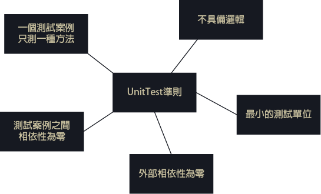
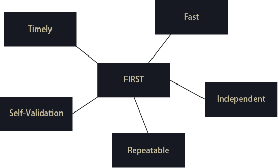
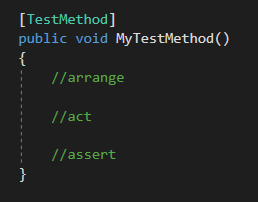

## 甚麼是測試
防範再需求、設計、架構、開發、部屬等過程中所隱含的錯誤，越早發現問題，解決成本越低  
測試類型:
* 功能面：使用者需求
* 架構面：效能、負載、安全、安全、易用性、管理、整合  

測試層級:單元、元件、模組、整合、系統  
測試實施方式:黑箱、白箱、灰箱  
測試平台、工具、案例管理、環境、資料蒐集、結果分析  
### 手動測試
對軟體進行手工測試以發現缺陷的過程。測試人員是站在使用者的視角，並確保所有功能都按照需求文件中那樣工作。在這個過程中，測試人員執行測試用例並在不使用任何自動化工具的情況下手動生成報告。  
#### 何時適用手動測試
* 探索性測試：由行業專家進行探索性測試。他們通過探索應用程式的功能來執行測試，而不瞭解詳細的需求。
* 可用性測試：驗證軟體是否使用者友好，是否被終端使用者舒適地使用。主要重點是檢查終端使用者是否能夠輕鬆理解和操作軟體。一個好的軟體應該是自我探索的，具有引導性的，並且不需要太多的培訓來操作它。
* 隨機測試：測試人員在不遵循任何文件和測試設計技術的情況下隨機測試軟體。如果試人員的知識非常豐富，則主要執行此類測試，測試人員在沒有任何測試用例或業務需求文件的情況下隨機測試應用程式。
#### 何時使用手動測試，而非自動化測試
* 當專案處於初始開發階段時，測試框架搭建完成前。
* 當測試使用者介面。
* 當需要進行探索性或隨機性測試。
* 如果專案是短期的，與手動測試相比，編寫指令碼和搭建測試框架非常耗時的時候。
* 如果測試用例不能自動執行驗證碼示例。
#### 手動測試的優劣
優：

* 適用範圍廣，可以在各種軟體上進行手動測試。
* 對於短生命週期產品更可取。
* 新設計的測試用例應該手動執行，以確保用例的正確性。
* 應用程式在自動化之前必須手動測試。
* 在需求頻繁變化的專案和GUI不斷變化的產品。
* 與自動化測試相比，它的初始投資更便宜。
* 開始手動測試所需的時間和費用更少。
* 它允許測試人員執行隨機測試。
* 測試人員沒有必要了解自動化工具和框架。  

劣：

* 手工測試主要是在做迴歸測試時耗時，而且重複性很大。
* 與自動化測試相比，手動測試不太可靠，因為有人的影響。所以總會有人為因素導致的一些錯誤。
* 從長遠來看，相比於自動化測試代價更高。
* 無法重用，因為無法記錄整個測試過程。

### 自動化測試

自動化測試是使用自動化工具來發現軟體缺陷的測試過程。在這個過程中，自動化工具會自動執行測試指令碼並生成結果。一些最流行的自動化測試工具是QTP、Selenium Webdriver，Jmeter, TC等。

常用的自動化工具：

* HP 
* QTP
* Selenium
* LoadRunner
* SilkTest
* List item
* TestComplete
* WinRunner
* Jmeter

#### 何時適用自動化測試
* 迴歸測試：  
對一個已經測試過的缺陷，在修改後進行的重複測試，目的是用於發現由於軟體或其他相關或不相關的軟體元件的變化而引入的任何缺陷。迴歸測試非常適合做自動化測試，因為軟體經常更改程式碼，而且需要進行及時的測試。
* 效能測試：  
測試軟體的速度、可伸縮性和穩定性。效能是指實現滿足專案或產品效能目標的響應時間、吞吐量和資源利用率級別。它非常適合自動化測試。  

可以同時進行手動和自動化測試的測試型別：  

* 系統測試：測試軟體是否符合其指定的要求實現，也稱端到端測試。目標是驗證已完成的系統，以確保應用程式是否按預期工作。
* 單元測試：單元測試也稱為模組測試或元件測試。為了檢查程式碼的單元或模組是否正常工作。通常由開發人員在開發人員的環境中完成的。
* 驗收測試：通常它由終端使用者和測試人員一起完成的，以驗證軟體的功能是否按照使用者需求來實現。進行測試後，客戶可以接受或拒絕所提供的軟體功能。驗收測試的型別有Alpha、Beta和Gamma測試。  

#### 哪些場景不適合自動化測試
* 探索性測試
* 使用者介面測試
* 隨機測試
#### 何時使用自動化測試，而非手動測試
* 處理重複和耗時的任務
* 併發測試
* 非功能性測試，如負載、效能、壓力測試
* 避免人為錯誤
* 自動化測試的優劣  

優：

* 自動化測試的執行速度更快。
* 從長遠來看，它比手工測試便宜。
* 自動化測試更可靠。
* 自動化測試可擴充套件性好和更通用。
* 用於迴歸測試。
* 可重用，因為自動化過程可以被記錄。
* 它不需要人為干預。測試指令碼可以在無人蔘與的情況下執行。
* 它有助於提高測試覆蓋率。  

劣：

* 僅推薦用於大型，穩定的產品。
* 自動化測試最初費用很昂貴。
* 大多數自動化工具都很昂貴，當然除開源軟體外。
* 它會有有一些限制，例如處理驗證碼，獲取ui的視覺方面的資訊。
* 需求反覆變化時。
* 不是所有的工具都支援各種測試如windows、web、移動性、效能/負載測試。

## 手動測試與自動測試有甚麼不同
|參數 | 手動測試 | 自動化測試 |
|---|---|---|
|定義 | 由人工測試人員執行 | 使用自動化工具來執行 |
|處理時間 | 非常耗時且佔用人力 | 由工具或腳本執行， 明顯比手動更快 |
|探索性 測試 | 允許隨機測試 | 不允許隨機測試 |
|初期投資 | 初期投資較低 | 初期投資較高 |
|可靠性 | 因人為錯誤的可能性而降低準確性 | 由工具和腳本執行，沒有測試疲勞 |
| UI 變更 |不影響手動測試的執行 | 需修改測試腳本以如預期執行 |
| 投資 | 需投資人力資源 | 需投資測試工具與自動化工程師 |
| 成本效益 | 高量不符合成本效益 | 低量不符合成本效益 |
| 測試報告能見度 | 通常記錄在Excel或Word中，測試結果不易/隨時可用。 | 所有相關者都可登錄自動化系統並檢查測試執行結果 |
| 人員觀察 | 對於提供用戶友好系統以改進用戶體驗是有用的 | 無法保證用戶友好性和積極的用戶體驗 |
| 性能測試 | 無法使用手動進行測試 | 須強制由自動化工具進行測試 |
| 並行執行 | 可並行執行，但需增加人力資源 | 可在不同平台執行，減少測試時間 |
| 批量測試 | 無法批量處理 | 可批量處理多個腳本來執行 |
| 編程知識 | 無需進行編程 | 必須，不可少的 |
| 構建驗證測試 | 非常困難且耗時 | 較易且有用 |
| 框架 | 不使用框架，但可能使用指南、核對表 | 用數據、關鍵字、混合等框架來加速過程 |
| 測試設計 | 手動測試不會將設計推到編碼過程 | 自動化測試強制/驅動測試 |
| DEVOPS | 違背DevOps的自動構建原則 | 有助於構建驗證測試，是DevOps Cycle的重要組成部分 |

___
___
## 各種手動軟體測試方式
* 黑盒測試：黑盒測試是一種軟體測試方法，測試人員在測試中測試被測軟體的功能，而不檢視內部程式碼結構。這可以應用於軟體測試的各個層次，如單元、整合、系統和驗收測試。  
* 白盒測試：它是基於應用程式內部的程式碼結構的測試。在白盒測試中，系統的內部視角以及程式設計技巧被用來設計測試用例。這種測試通常在單元級別進行。  
* 單元測試：也稱模組測試或元件測試。這樣做是為了檢查原始碼的單個單元或模組是否正常工作。通常它是由開發人員在開發人員的環境中完成的。  
* 系統測試：測試完整的應用程式，以評估系統是否符合其客戶的需求，我們稱之為系統測試，也稱為端到端測試。目標是已完成的系統，以確保軟體是否按預期工作。  
* 整合測試：整合測試是測試兩個軟體單元之間介面的過程。整合測試有三種方式。大爆炸法，自上而下法，自下而上法。  
* 驗收測試：通常它由終端使用者和測試人員一起完成的，以驗證軟體的功能是否按照使用者需求來實現。進行測試後，客戶可以接受或拒絕所提供的軟體功能。驗收測試的型別有Alpha、Beta和Gamma測試。

### 白箱測試(white-box testing or structural testing)
* 主要針對結構面做測試
* 主要分成兩個層面: 資料流程面(Data flow coverage) 與 控制流程面(Control flow coverage)

舉例來說：  
當測試人員在使用新線上訂單系統時，需依使用者操作邏輯面去進行測試

1. 使用者選擇商品成立一筆訂單
2. 在單據內填寫設定相關必填資料後完成訂單
3. 完成訂單後再進行線上繳款動作
4. 成功完成線上繳款交易等模擬測試  

系統不能出現無回應狀態、以及不可出現例外錯誤，當出現錯誤時需停止測試，將相關問題回報給開發人員進行修正及調整，調整完成再進行測試。此時應該是貼近使用者的使用情況，找出使用者會遇到的操作問題。

優點：  
有明確的測試目標  
缺點： 
需要考慮測試的複雜程度，不可過於複雜或容易，有時會遺失欲測試的目標。
### 黑箱測試(black-box testing)

測試人員以程式安全面進行系統測試與檢驗，例如測試人員在使用新線上訂單系統時，以模擬黑客方式進行測試：
1. 使用線上訂單系統進行測試時，輸入商品數量的極大值或極小值的執行情形是否有錯 
2. 在單據內在填寫相關欄位資料時，填寫錯誤格式資料，例如手機號碼的格式錯誤或長度過長。  

測試人員在以上操作過程中，以駭客的思考模式對系統進行檢測，若檢測結果影響到系統穩定性與安全性時，需請開發人員進行修正與調整。

優點：  
可以有效檢測系統弱點  
缺點：
耗費時長，且需要反覆測試才能確保系統穩定性與安全性。  

### 單元測試(unit test)

1. 一個測試案例只測一種方法  

若一個測試案例測了多種方法，那你這個測試案例就會很複雜，假設今天這個測試案例中有很多種方法，如果這個測試案例錯了，你會不知道錯在哪一個方法之中。  
2. 最小的測試單位  
3.  外部相依性為零
不與外部（包括檔案、資料庫、網路、服務、物件、類別）直接相依 
不與外部相依的原因是需要排除「不是在我們的方法上出錯」的可能性，假設相依在線上的資料庫上，很有可能會因為網路、資料庫被異動而導致測試案例失敗的可能，所以不與外部直接相依，而是以stubs、mock的方式來進行單元測試。  
4. 不具備邏輯   
單元測是本身不可以具備邏輯，如果單元測試具備了邏輯那就需要在寫一個測試來測試這個測試案例是不是正確的，這樣一看就知道是一個不符合邏輯以及奇怪的事情。
5. 測試案例之間相依性為零  
測試案例之間如果有相依性，那就很有可能會造成測試案例之間的「干擾」，假設某一個B測試案例需要A測試案例先啟動才會通過，如果A測試案例不過，B測試案例就不會過，這樣就會干擾我們去判斷今天是因為錯了A才錯B還是B本身就是錯的。

* 最小單元FIRST原則  

1. Fast：快速。  
好的單元測試要可以快速的執行完成。
2. Independent：獨立。  
好的單元測試要是獨立性的，也就是無相依的。
3. Repeatable：可重複。  
好的單元測試要是可以重複執行的。
4. Self-Validating：可反應驗證結果。  
好的單元測試是要可以真的驗證一件事情的結果的，不需要透過人為的操作來進行驗證。
5. Timely：及時。  
單元測試的程式碼與產品程式碼是兩個一起完成的。  

3A原則是單元測試的開始，常常在寫測試的時候不知道該如何開始就可以直接在程式碼寫下這三行再開始

不過這3A到底是甚麼意思呢?

* Arrange  
初始化物件、相依物件、方法參數、預期結果或是預期的互動方式
* Act  
呼叫被測試的目標物件方法
* Assert  
驗證是否符合預期  

通常看到這一些變肥的單元，我們必須要想辦法把它拆解，重構，讓這些單元「可測試化」，但我們這一次要說的主題是預防寫出難以「可測試」的程式，所以我們需要TDD來幫助我們寫出「可測試」的程式。

參考網址:
https://ithelp.ithome.com.tw/articles/10192184  

測試案例(test case)  
基本資訊:
* 案例編號、名稱、說明、區域、擁有人、優先權、狀態、系統環境、應執行的情境與頻率
* 動作步驟:步驟完備、說明簡單、可執行
* 預期結果:可明確判讀
* 實際結果:完整、明確